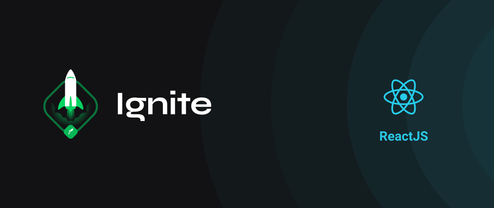
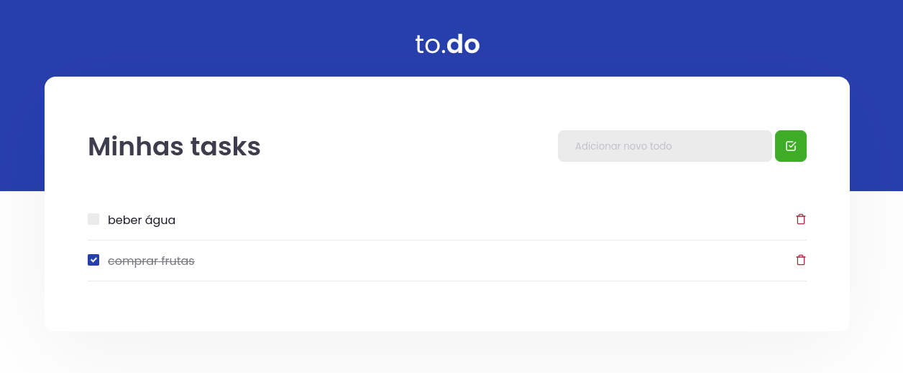

<h1 align="center">
  
</h1>

<h4 align="center">
  🚀 [Ignite] Desafio 01 - Trilha ReactJS
</h4>

## 💻 Projeto

Projeto desenvolvido durante o programa de aceleração profissional **Ignite**, oferecido pela [Rocketseat][rocketseat].
A ideia do projeto é desenvolver uma pequena aplicação de atividades a fazer, com as seguintes funcionalidades:

- Adicionar uma tarefa
- Remover uma tarefa
- Marcar e desmarcar uma tarefa comom concluída

## 🛠 Tecnologias

As seguintes tecnologias foram utilizadas no desenvolvimento do projeto:

- [Babel][babel]
- [React][reactjs]
- [Sass][sass]
- [TypeScript][typescript]
- [Webpack][webpack]

## 📷 Screenshots

<kbd>
  
</kbd>

[babel]: https://babeljs.io/
[reactjs]: https://reactjs.org/
[rocketseat]: https://rocketseat.com.br/
[sass]: https://sass-lang.com/
[typescript]: https://www.typescriptlang.org/
[webpack]: https://webpack.js.org/
